<!-- Generated by GitHub Profile Agent Console. Edit profile.config.json, then run npm run generate. -->

  <picture>
    <source media="(max-width: 760px) and (prefers-color-scheme: dark)" srcset="./assets/hero/agent-console-afba3877-mobile-dark.svg">
    <source media="(max-width: 760px)" srcset="./assets/hero/agent-console-afba3877-mobile-light.svg">
    <source media="(prefers-color-scheme: dark)" srcset="./assets/hero/agent-console-afba3877-dark.svg">
    <source media="(prefers-color-scheme: light)" srcset="./assets/hero/agent-console-afba3877-light.svg">
    
  </picture>

  
  

## About Me

## About Me

I'm **Muhammad Hanif Hibatulloh**, a Computer Science student at **Universitas Jenderal Achmad Yani** with a strong interest in **Software Engineering, Backend Development, Artificial Intelligence, and Machine Learning**.

I enjoy turning ideas and requirements into working solutions—from designing databases and backend systems to developing machine learning and computer vision models. My projects include web-based information systems, CNN-based image classification, and EEG deep learning research.

I approach every project by first understanding the problem, designing a practical solution, testing the implementation, and improving it based on measurable results.

---

## Current Focus

| Area | What I am working on |
| --- | --- |
| **Software Engineering** | Designing maintainable software systems with structured architecture, database design, testing, and clean implementation. |
| **Backend Development** | Building server-side applications with authentication, role-based access control, database integration, and business logic. |
| **AI & Machine Learning** | Exploring practical machine learning and deep learning applications that can be integrated into real software systems. |
| **Computer Vision** | Developing image-classification solutions using preprocessing, CNN-based models, prediction, and model evaluation. |

---

## Featured Work

| Project | Focus | Overview |
| --- | --- | --- |
| [**EEG Motor Imagery & Concentration Classification**](https://github.com/hanifhibatulloh-dev/eeg-motor-imagery-concentration-classification) | EEG · Deep Learning · Signal Processing | PKM research project exploring DWT, Multi-Scale CNN, and Vision Transformer approaches for EEG motor imagery and concentration classification. |
| [**Banana Ripeness Classification Using CNN**](https://github.com/hanifhibatulloh-dev/banana-ripeness-classification-cnn) | Computer Vision · Deep Learning | CNN-based image classification for Green, Semi-ripe, Ripe, and Overripe bananas, achieving **95.12% test accuracy**. |
| [**Archive Management System**](https://github.com/hanifhibatulloh-dev/archive-management-system) | Software Engineering · Web Development | Web-based archive management system featuring authentication, role-based access control, relational database integration, audit logs, and reporting. |

---

## Beyond Code

My experience also includes **research collaboration, leadership in a pesantren environment, teamwork, communication, and creative production**.

I have worked on collaborative academic research and also led creative projects involving **concept development, scriptwriting, camera operation, production coordination, and multimedia execution**.

These experiences have strengthened my ability to communicate ideas, coordinate teams, and take ownership of projects from concept to completion.

---

## Tech Stack

### Programming & Web
`Python` · `PHP` · `Java` · `JavaScript` · `HTML5` · `CSS3` · `React` · `Bootstrap`

### Database & Backend
`MySQL` · `SQL` · `PDO` · `Database Design` · `ERD` · `Role-Based Access Control`

### AI & Machine Learning
`TensorFlow` · `Keras` · `Scikit-learn` · `CNN` · `Computer Vision` · `Vision Transformer`

### Tools
`Git` · `GitHub` · `Figma` · `VS Code`

---

## Education

**Bachelor of Computer Science**  
Universitas Jenderal Achmad Yani  
2024 – Present

**GPA:** 3.49 / 4.00

Main interests:

`Software Engineering` · `Artificial Intelligence` · `Machine Learning` · `Backend Development` · `Computer Vision`

---

## Connect With Me

---

## Recent Activity

<!-- AUTO:ACTIVITY:START -->
_Recent public activity will appear here after the workflow runs._
<!-- AUTO:ACTIVITY:END -->

---

  Building reliable software and intelligent systems, one project at a time.

